# Bitcoin_Arbitrage_Analysis
This Application collects , prepare and analyze Bitcoin coin data across two exchanges (Bitstamp and Coinbase) and tells if there are any arnitrage opportunities fot it.

---

## Technologies

This application works on python 3.7 and uses following libraries:

* [fire](https://github.com/google/python-fire) - For the command line interface and entry-point.

* [questionary](https://github.com/tmbo/questionary) - For user interactive inputs and dialogs.

* [matplotlib](https://github.com/matplotlib/matplotlib.git) - For creating static, animated, and interactive visualizations.

---

## Installation Guide

Follow the following instructions before using the application.

```python
  pip install fire
  pip install questionary
  pip install -U matplotlib
```
---

## Detailed Explanation

Bitcoin Arbitrage Analysis has following three phases

1. Data Collection
2. Data Preparation
3. Data Analysis

### Data Collection
Dataframes `bitstamp` and `coinbase` is created using the Pandas `read_csv` function and the `Path` module by importing the data from `bitstamp.csv` file and `coinbase.csv` file. The `Timestamp` column is set as index column

### Data Preparation
Collected data is then prepared and cleaned for analysis by following the steps below for both `bitstamp` and `coinbase` dataframes:

1. Replaced all `NaN`, or missing, values in the DataFrame with mean of that column.

2. Using the `str.replace` function to remove the dollar signs `$` from the values in the Close column.

3. Convert the data type of the Close column to a `float`.

4. Review the data for duplicated values, and dropping them.

### Data Analysis
#### Step 1: Choosing columns `Close` and `Timestamp` of data on which to focus analysis by displaying summary statistics and plotting it.
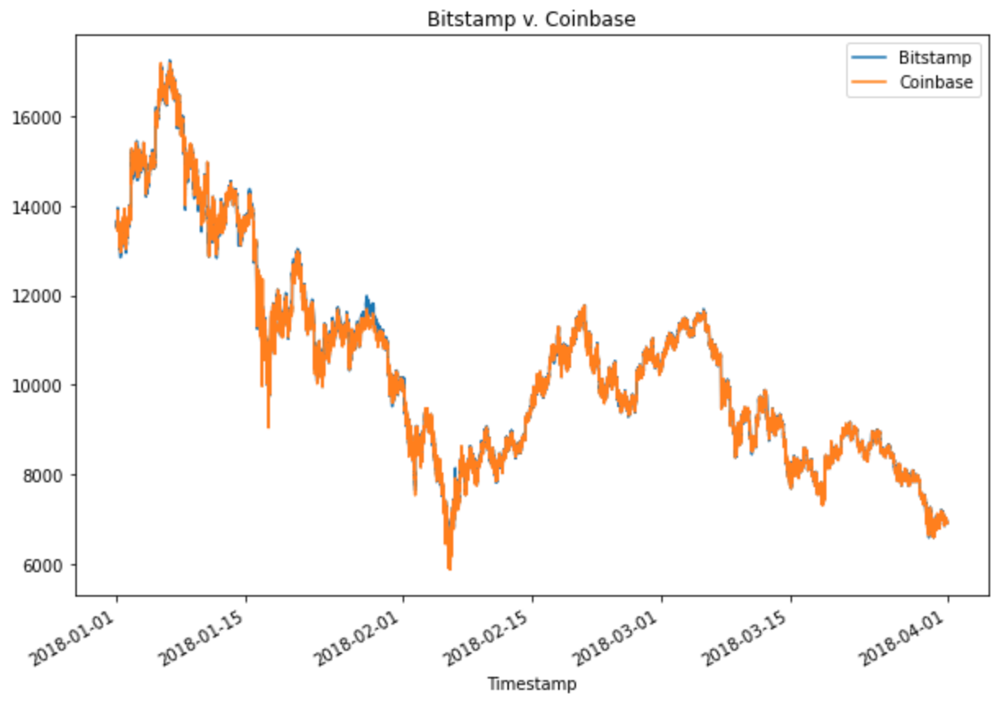
#### Step 2: Analysis on Specific Dates
1. Selected three dates to evaluate for arbitrage profitability.
* Choosing one date that’s early in the dataset(January 28, 2018). Assuming that we buy from coinbase and sell in bitstamp marketplace.
* One from the middle of the dataset(February 24, 2018). Assuming that we buy from bitstamp and sell in coinbase , and
* One from the later part of the time period(March 28, 2018). Assuming that we buy from coinbase and sell in bitstamp marketplace.
2. Calculates  arbitrage spread for each dates and displayed summary statistics and box plots of arbitrage spread for selected dates respectively.
Given below is example of one selected dates.
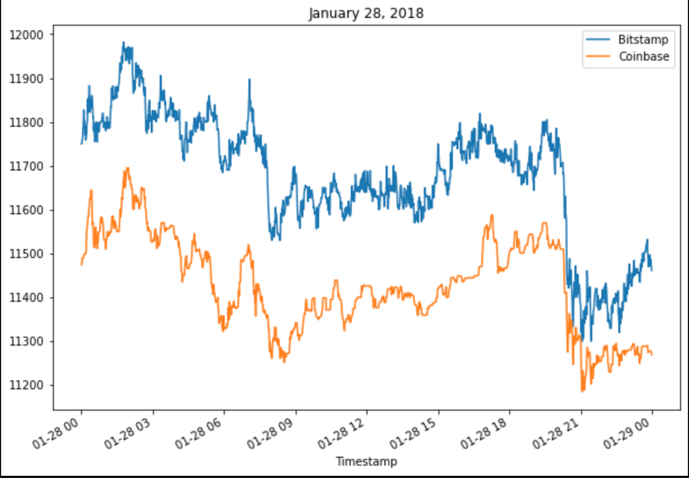
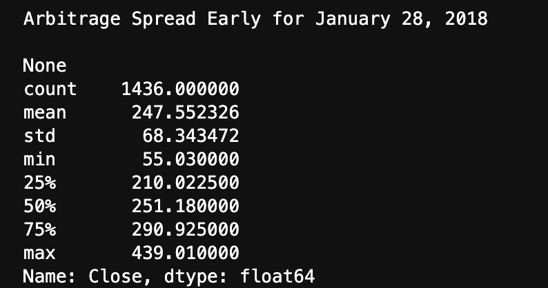
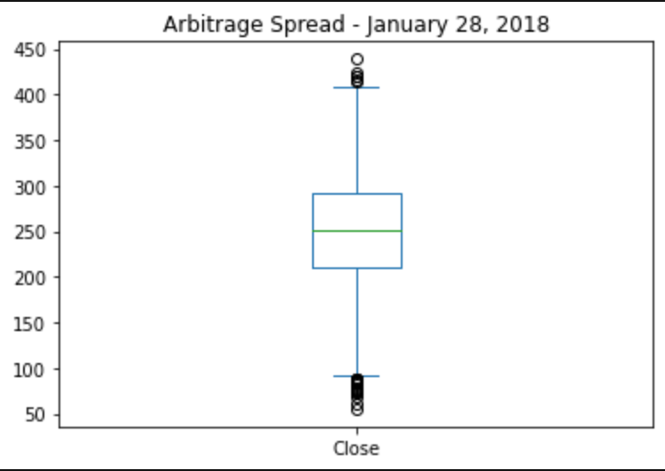
#### Step 3: Calculating Arbitrage Profits
1. Arbitrage spread between the two exchanges is calculated by subtracting the lower-priced exchange from the higher-priced one.
2. Calculated the spread returns by dividing the instances that have a positive arbitrage spread by the price of Bitcoin from the exchange we buy it.
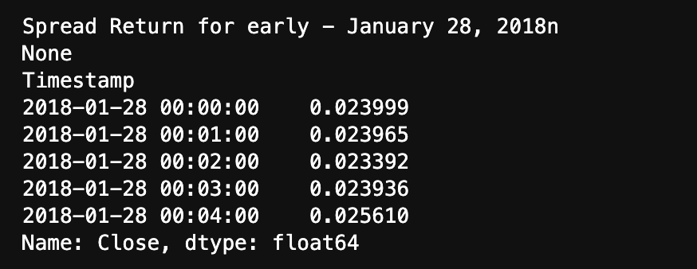
3. Calculating Profitable trade for each selected dates by selecting the trades that exceeds minimum threshold of 1%(0.01) and displaying it.
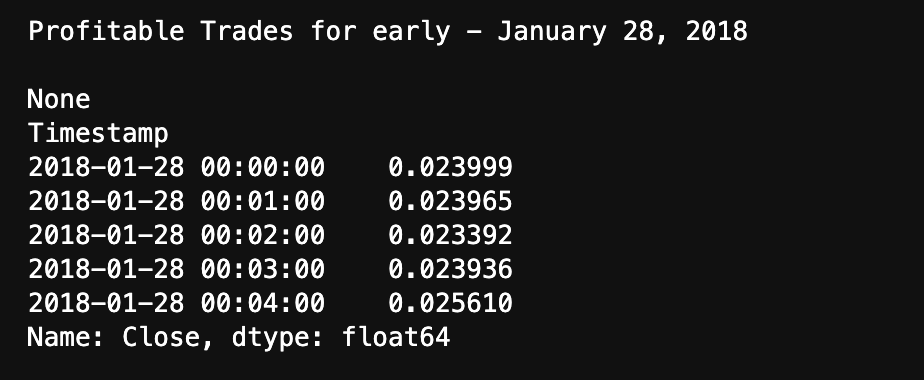
4. Generating Summary statics for all profitable trades.
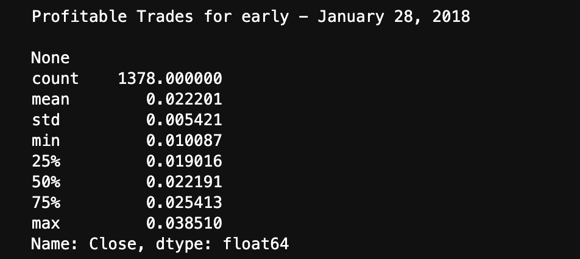

#### Comparison of the three average returns.
1. The average profitable trades on January 28, 2018 is **2.2%** which is the largest/highest among all three dates.
2. The average profitable trades on February 24, 2018 is **1.1%** which is still good compared to March.
3. There is no profitable trades on March 28,2018.

5. calculating the profit per trade in dollars by multipling the non null spread returns that were greater than 1% by the cost of what was purchased(bitstamp or coinbase)
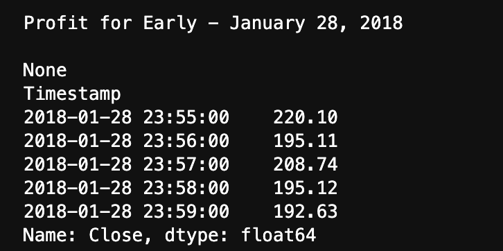
6. Generating summary statistics and plotting profit per trade for each selected dates.
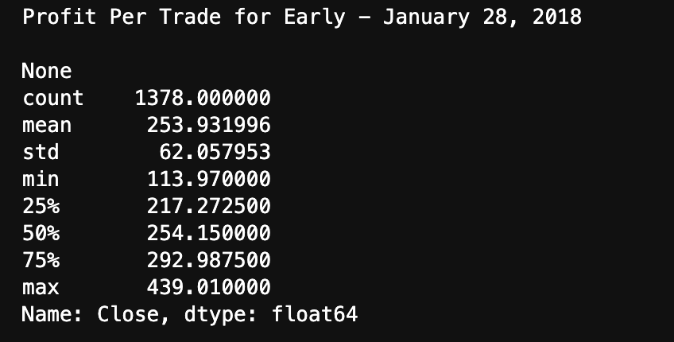
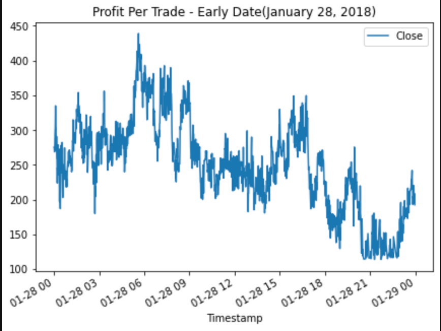
7. Calculating the potential arbitrage profits for each selected dates by calculating sum of all elements in the profit_per_trade DataFrame.
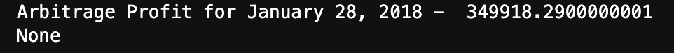
8. Calculating cumulative sum of each of the three profit_per_trade DataFrames and plotting the cumulative sum for the three selected dates.
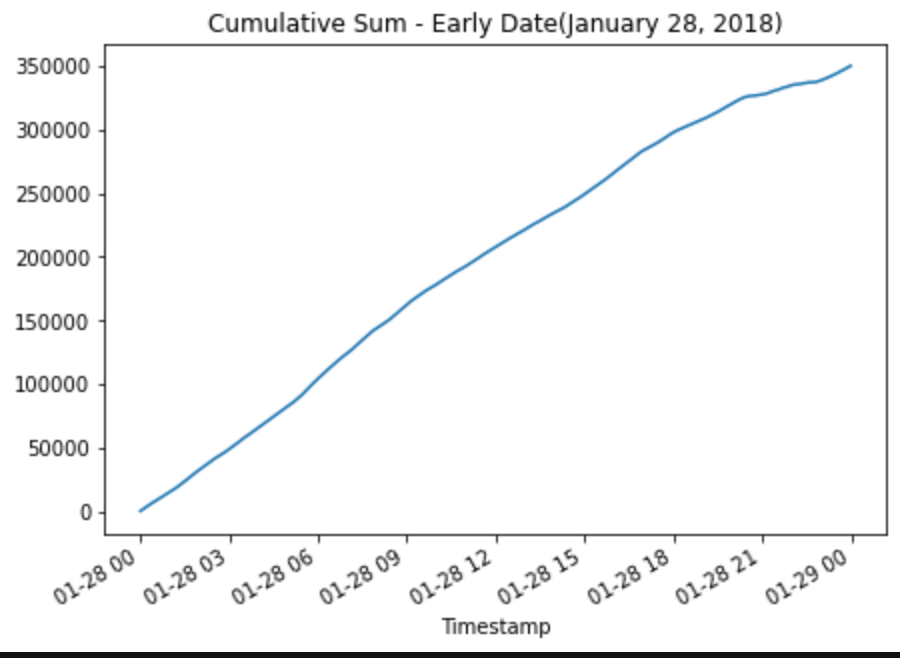

---

## Summary
![summary][Resources/Images/summary.png]

---

## Contributors

Created by Rupika Ranjan Babu

---

## License

MIT


